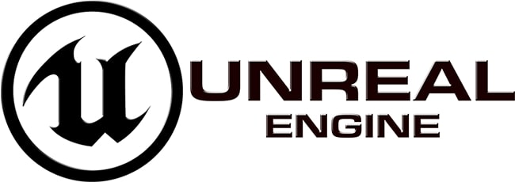

# UE5_ToonTanks

Source code and assets generated while doing Section 5 of GameDev.tv [Unreal Engine 5 course](https://www.udemy.com/course/unrealcourse): ***Toon Tanks***.

Refer to the [project setup video](https://www.udemy.com/course/unrealcourse/learn/lecture/31742830#overview) from the course for the full setup of the project.

**Unreal Engine Version used**: 5.3.2

